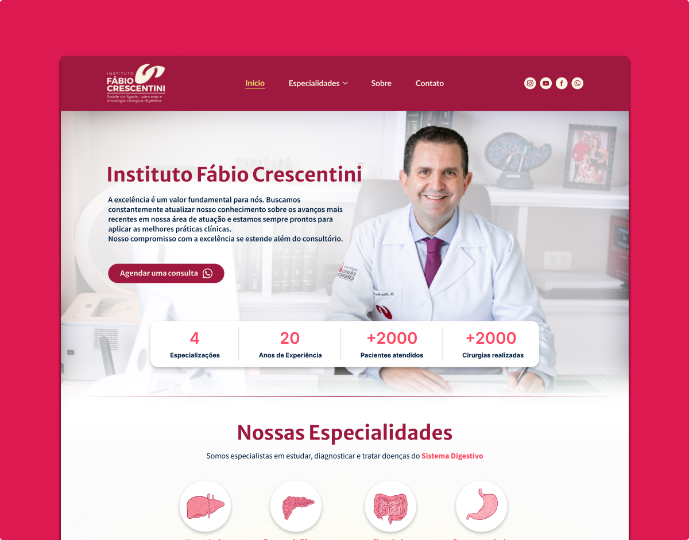

<div align="center" id="top">
  

&#xa0;

</div>

<h1 align="center">Instituto Fábio Crescentini</h1>

<!-- <h4 align="center">
	🚧   Under construction...  🚧
</h4> -->
<!-- <hr> -->

<p align="center">
  <a href="#-sobre">Sobre</a> &#xa0; | &#xa0;
  <a href="#-funcionalidades">Funcionalidades</a> &#xa0; | &#xa0;
  <a href="#-tecnologias">Tecnologias</a> &#xa0; | &#xa0;
  <a href="#-requisitos-para-rodar-a-aplicação">Requisitos</a> &#xa0; | &#xa0;
  <a href="https://github.com/joaotelesk" target="_blank">Autor</a>
</p>

<br>

## 🧠 Sobre

O projeto consiste na criação de um site institucional para o médico Fábio Cescentini, assegurando fidelidade ao protótipo inicial e priorizando a experiência do usuário (UX), com ênfase na construção pela equipe de designers de UX e marketing da Empresa X.

## Paginas

- Home
- Sobre
- Especilidades/Hepatalogia
- Especilidades/Doenças do Pâncreas
- Especilidades/Cir. do Ap. Digestivo
- Especilidades/Gastroenterologia
- Contato


### As atividades do projeto:

- Escolha das tecnologias: Next.js, TypeScript, Tailwind.

### Os objetivos do projeto:

- Criar um website institucional que atenda as necessidades do cliente.


### Os resultados do projeto:

- O projeto resultou no aperfeiçoamento:
  - Utilização da versão 13 Next.js.
  - Utilização da biblioteca framer-motion
  - redução de envio de codigo js desnecessário para navegador
- Construção de um projeto para portfólio.

<!-- Links:

- [Site](https://site-consultoria-ecru.vercel.app/)
- [Github](https://github.com/joaotelesk/site-consultoria)
- [Figma](https://www.figma.com/file/S4GHwiUZtcG9eHlrCiJNRP/Site---Imigrei?t=EeCajIjeREel6I8W-7) -->

  <br/>

## 🛹 Funcionalidades

✔️ Navegacão entre pagina do tipo SPA

✔️ links para whatasapp ou paginas de Informações relevantes


<br/>

## 🚀 Tecnologias

Abaixo você poderá ter acesso às principais tecnologias usadas neste projeto

- [NextJS](https://nextjs.org/)
- [TypeScript](https://www.typescriptlang.org/)
- [Tailwind CSS](https://tailwindcss.com/)

## ✅ Requisitos para rodar a aplicação

Antes de iniciar 🏁, você precisa ter [Git](https://git-scm.com) e [Node](https://nodejs.org/en/) instalado em seu sistema operacional.

<br/>

## 🏁 Iniciando

```bash
# Clone este projeto
$ git clone https://github.com/joaotelesk/instituto-fabio-crescentini
# Acesse
$ cd instituto-fabio-crescentini
# Instale as dependências
$ yarn
# Execute o projeto
$ yarn start
# O projeto será inicializado em <http://localhost:3000>
```

<br/>

Feito com 💜 por <a href="https://github.com/joaotelesk" target="_blank">João Teles</a>

&#xa0;

### Vamos nos conectar?

- [instagram](https://www.instagram.com/jaootelesk)
- [linkedin](www.linkedin.com/in/joaotelesk)
- [github](https://github.com/joaotelesk)

<br />
<br />
<a href="#top">Voltar ao topo</a>